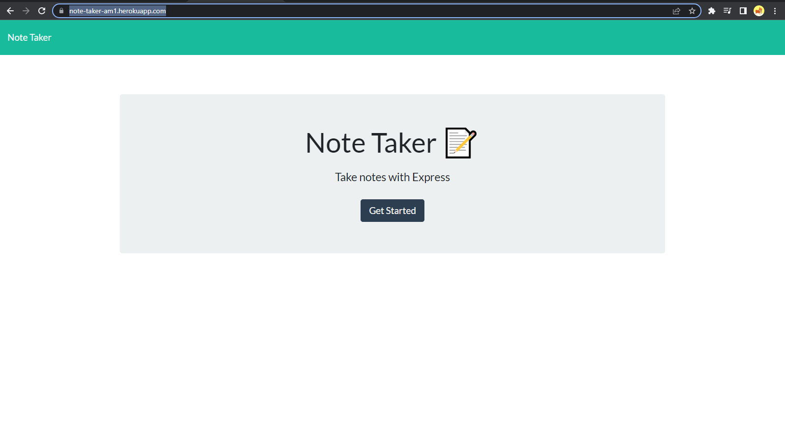

# Note - Taker


## Description 
This application is titled 'Note Taker' and it can be used to write, save, or delete notes. The application is routed on the backend using Express.js and uses a JSON file as a database to read from and write to. It allows the user to create a list of notes or reminders, and delete those notes once they are complete or no longer useful. The application is deployed using Heroku.
 
## Table of Contents
* [Installation](#installation)
* [Usage](#usage)
* [License](#license)
* [Contributing](#contributing)
* [Questions](#questions)

## Installation 
Users should clone this repository from GitHub. Once the repo is cloned, the user should install the dependices with ```npm i```. 

## Usage 
Run the server using ```node server.js``` in the terminal.<br>


<br>


## License 
This project is licensed under MIT

## Contributing 
Contributors should read the installation section. 

## Questions
If you have any questions about this projects, please contact me directly at aumcintyre@gmail.com. You can view more of my projects at https://github.com/aumcintyre.